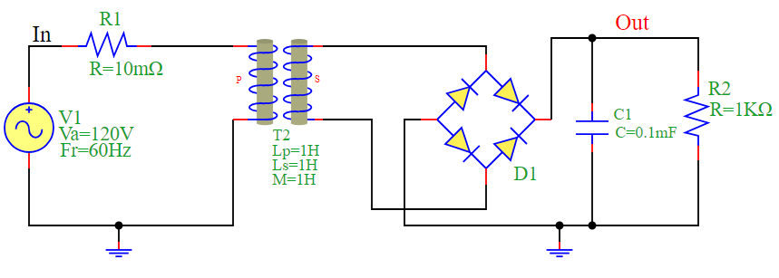
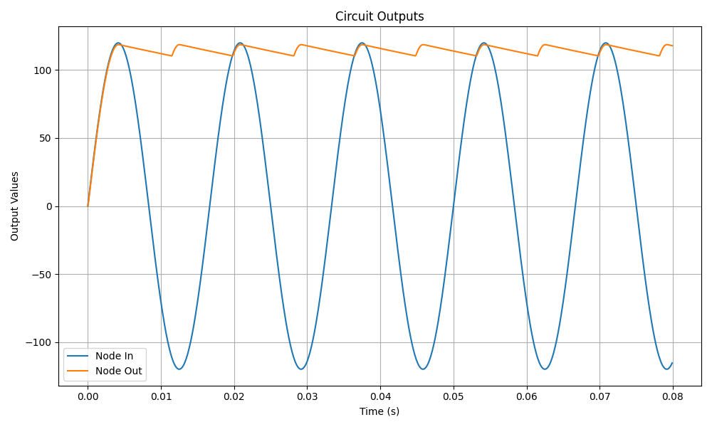

.. title:: AC to DC Converter Simulation

==========================
AC to DC Converter
==========================

An AC to DC converter is an electronic circuit that converts alternating current (AC) input voltage into direct current (DC) output voltage. This is commonly achieved using a rectifier circuit, followed by a filtering capacitor to smooth the DC output.

------------------------------
Circuit Description
------------------------------

The circuit consists of:

- **AC Voltage Source (V1)**: Provides an alternating voltage of 120V at a frequency of 60Hz.
- **Resistor (R1)**: A small series resistance of 10mΩ.
- **Transformer (T2)**: Steps up or down the voltage.
- **Diode Bridge (D1)**: A full-wave rectifier that converts AC to pulsating DC.
- **Capacitor (C1)**: Acts as a filter to smooth the rectified voltage.
- **Load Resistor (R2)**: Represents the circuit's output load with a resistance of 1KΩ.

------------------------------
Circuit Diagram
------------------------------

------------------------------
Mathematical Equations
------------------------------

1. **AC Input Voltage**:

- :math:`V_{in}(t) = V_a \sin(2\pi f t)`

2. **Rectified Output Voltage** (Ideal Case):

- :math:`V_{out}(t) = |V_{in}(t)|`

3. **Filtered DC Output Voltage Approximation**:

- :math:`V_{dc} \approx V_{peak} - I_{load} \times R_{equiv}`

   where:
   
   - :math:`V_{peak}` is the peak AC voltage after rectification,
   - :math:`I_{load}` is the current through the load resistor,
   - :math:`R_{equiv}` accounts for internal resistance and voltage drops.

------------------------------
Simulation Results
------------------------------

The following plot illustrates the input and output voltages of the AC to DC converter.

------------------------------
Conclusion
------------------------------

The simulation demonstrates how an AC signal is rectified and filtered to produce a nearly constant DC output. The capacitor smooths the rectified waveform, reducing ripples and providing a more stable DC voltage suitable for electronic applications.

