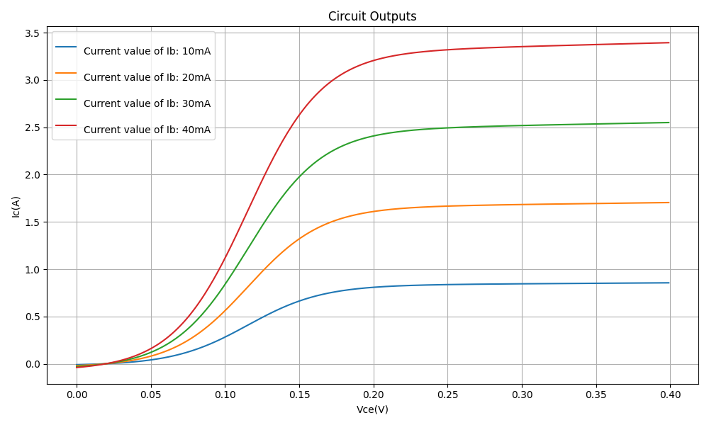

.. _bjt_characteristics:

BJT Characteristics Analysis
============================

Introduction
------------
A **Bipolar Junction Transistor (BJT)** is a semiconductor device used for amplification and switching applications. In this document, we analyze the **collector current (I\ :sub:`C`) versus collector-emitter voltage (V\ :sub:`CE`)** characteristics for different base currents (I\ :sub:`B`).

Equations
---------
The fundamental equation governing the BJT in active mode is:

.. math::
    I_C = \beta I_B

where:

- :math:`I_C` is the collector current,
- :math:`I_B` is the base current,
- :math:`\beta` is the current gain of the transistor.

The collector-emitter voltage is given by:

.. math::
    V_{CE} = V_C - V_E

Circuit Description
-------------------
The circuit consists of:

- A DC current source supplying base current (:math:`I_B`),
- A DC voltage source (:math:`V_{CC}`),
- An NPN transistor (:math:`Q_1`),
- A resistor (:math:`R_1`) to limit base current.

Circuit Diagram
---------------
.. image:: BJT_characteristics_circuit.png
    :alt: BJT Characteristics Circuit

Simulation Results
------------------
The results obtained from the simulation show how the collector current varies with the collector-emitter voltage for different base currents.

Conclusion
----------
This simulation provides insights into the BJT's behavior under different base currents, demonstrating its amplification properties. The **collector current increases with base current**, confirming the fundamental transistor operation principle.

