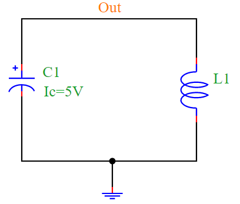
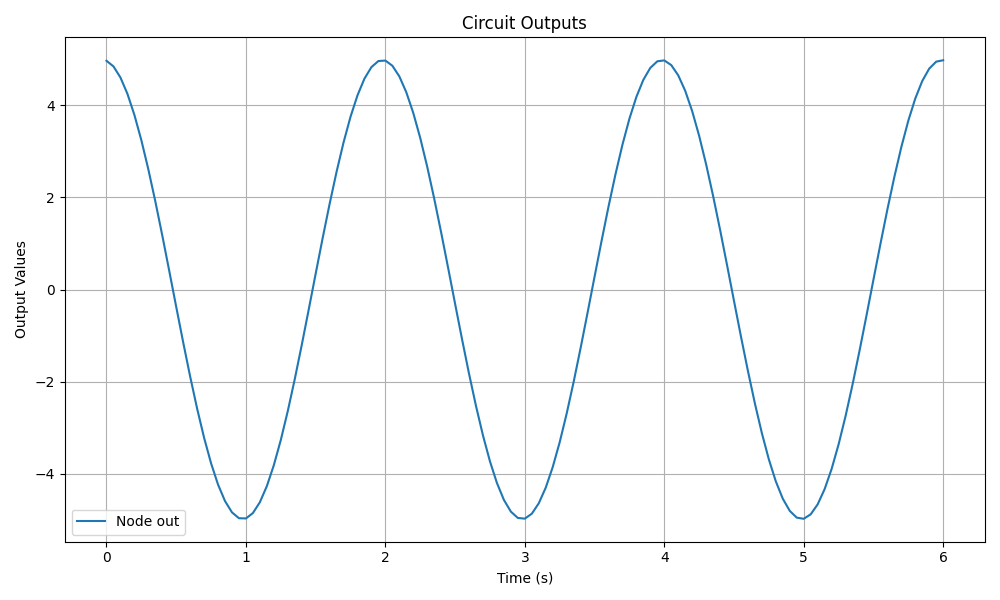

LC Oscillator Simulation
========================

Overview
--------

The circuit consists of an **inductor (L1)** and a **capacitor (C1)** forming an LC oscillator. The capacitor stores energy in an electrostatic field, producing a potential voltage across its plates, while the inductor stores energy in an electromagnetic field. 

Initially, the capacitor is charged to **Ic = 5V**. When the capacitor discharges through the inductor, energy oscillates between the capacitor and the inductor, generating a sinusoidal waveform.

Oscillation Frequency
---------------------

The resonant frequency of the LC circuit is given by:

.. math::

   f_r = \frac{1}{2\pi\sqrt{LC}}

For this simulation:

- **Resonant Frequency**: `fr = 0.5 Hz`
- **Time Period**: `T = 2 s`

Circuit Diagram
---------------

The LC oscillator circuit is illustrated in the following diagram:

Simulation Output
-----------------

The simulation generates the following sinusoidal waveform:

Conclusion
----------

The LC oscillator generates an AC waveform due to the continuous exchange of energy between the inductor and capacitor. The PyAMS simulation verifies this behavior by producing a sinusoidal voltage output over time.
