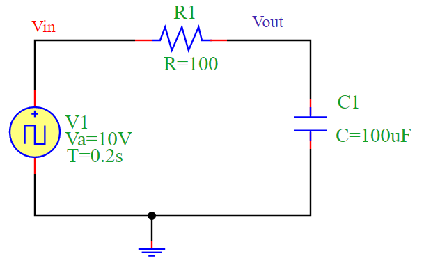
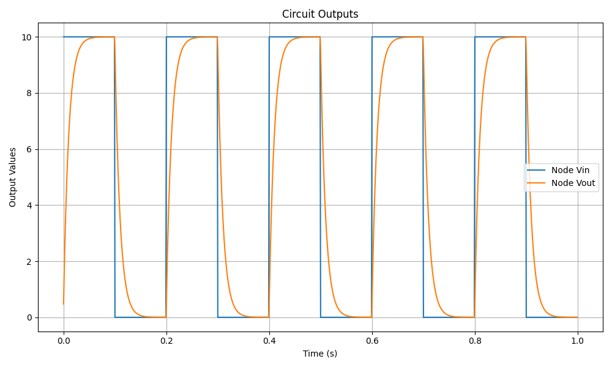

RC Circuit Simulation
=====================

Overview
--------

The circuit consists of a **resistor (R1)** and a **capacitor (C1)** forming an RC circuit. The circuit is driven by a **square wave voltage source (V1)**. 

- When the input voltage **Vin** switches from low to high, the capacitor **C1** begins charging through the resistor **R1**.
- When **Vin** switches from high to low, the capacitor discharges.
- This creates a characteristic **exponential charging and discharging** behavior.

Time Constant
-------------

The **time constant** (τ) of an RC circuit is given by:

.. math::

   \tau = R \cdot C

For this simulation:

- **Resistance**: `R = 100 \Omega`
- **Capacitance**: `C = 100 \mu F`
- **Time Constant**: `τ = 100 × 100 × 10^{-6} = 0.01 s`

Circuit Diagram
---------------

The following diagram illustrates the RC circuit:

Simulation Output
-----------------

The output voltage **Vout** follows an exponential response due to the capacitor's charging and discharging behavior. The simulation produces the following waveform:

Conclusion
----------

The RC circuit acts as a **low-pass filter**, smoothing the square wave input into a more gradual exponential waveform. The simulation confirms this behavior by displaying the expected charging and discharging curves.
