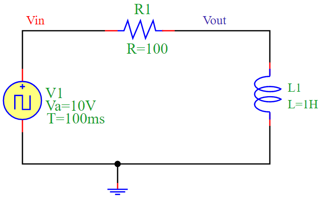
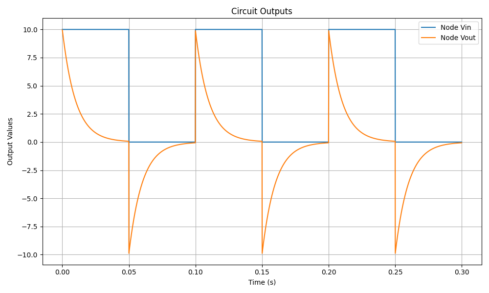

RL Circuit Simulation
=====================

Overview
--------

The circuit consists of a **resistor (R1)** and an **inductor (L1)** forming an RL circuit. The circuit is driven by a **square wave voltage source (V1)**.

- When the input voltage **Vin** switches from low to high, the inductor **L1** resists the change in current, causing a gradual increase in current through **R1**.
- When **Vin** switches from high to low, the inductor resists the decrease in current, resulting in an exponential decay of current through **R1**.
- This creates a characteristic **exponential response** to changes in voltage.

Time Constant
-------------

The **time constant** (τ) of an RL circuit is given by:

.. math::

   \tau = \frac{L}{R}

For this simulation:

- **Resistance**: `R = 100 \Omega`
- **Inductance**: `L = 1H`
- **Time Constant**: `τ = 1 / 100 = 0.01 s`

Circuit Diagram
---------------

The following diagram illustrates the RL circuit:

Simulation Output
-----------------

The output voltage **Vout** follows an exponential response due to the inductor’s resistance to changes in current. The simulation produces the following waveform:

Conclusion
----------

The RL circuit demonstrates **inductive behavior**, where the inductor resists changes in current, causing a smooth exponential rise and fall. This behavior makes RL circuits useful in applications such as filtering, signal processing, and energy storage.

