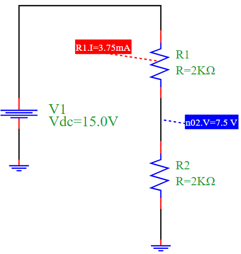

Voltage Divider Simulation
==========================

Overview
--------

This example demonstrates a basic **voltage divider** circuit using PyAMS, which is commonly used to scale down voltages. The circuit consists of:

- A DC voltage source `V1`
- Two resistors `R1` and `R2` in series
- The output voltage is measured across `R2`

The circuit divides the voltage proportionally based on the resistor values.

Circuit Diagram
---------------

Explanation
-----------

According to the voltage divider rule, the voltage across `R2` is given by:

.. math::

   V_{out} = V_{in} \cdot \frac{R2}{R1 + R2}

Given:
- :math:`V_{in} = 15V`
- :math:`R1 = R2 = 2k\Omega`

Then:

.. math::

   V_{out} = 15 \cdot \frac{2000}{2000 + 2000} = 7.5V

The current through the series resistors is:

.. math::

   I = \frac{V_{in}}{R1 + R2} = \frac{15}{4000} = 3.75mA

Simulation Results
------------------

.. code-block:: text

   Output Voltage at node n2: 7.5 V
   Output Current through R1: 3.75 mA

