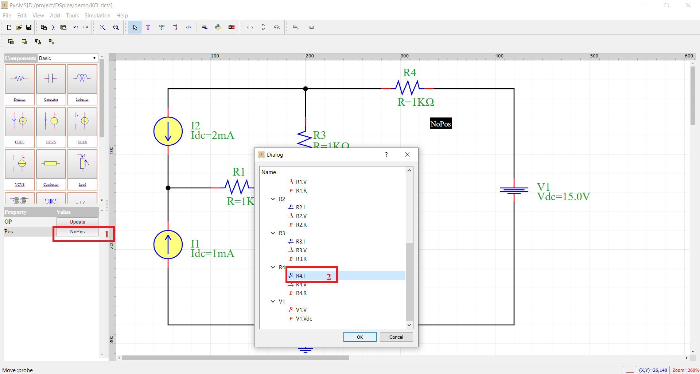

The steps of simulation 
=======================

The simulation of circuits in PyAMS-CAD is based by Graphical user interface in six steps:

:red:`Step a. Add Symbol in schematic`

* 1. Select Library
* 2. Click the symbol in the components list;
* 3. Click the position in the schematic;
* 4. Rotation

:red:`Step b. Linking elements by wire`

.. figure:: ../images/pyams_03.png

* 1. Click on the wire icon;
* 2. Connect the pins;
* 3. Modified name or color of wire;

.. note::

 You can finish drawing the wires by “end Menu".

:red:`Step c. Modifying parameters of elements`

.. figure:: ../images/pyams_06.png

* 1. Click on parameter
* 2. Change value or name

*  You can add new parameter or reference or label.

*  You can change global parameters from dialog.

.. note::
  These parameters in the dialog are automatically exported 
  from the Python model in the initial function.

.. note::
   You can modified model described by python language.

:red:`Step d. Adding a analysis in the circuit with adjusting type of analysis and add outputs`

.. figure:: ../images/pyams_10.png

* 1. Click on the analysis icon
* 2. Select Analysis
* 3. Select the type
* 4. Add outputs

:red:`Step e. run circuit`

* 1. Click on the analysis command icon.
* 2. Click Execute in the dialog box.
* 3. Exit.

:red:`Step f. results`

.. figure:: ../images/pyams_12.png

* The result present in plot.

.. figure:: ../images/pyams_13.png

* By show plot you can get values (X,Y).

Operating-Points
================

The OP analysis by PyAMS is find operating points in the circuit 
for time=0.
The simulation of circuits in OP is based by tree steps:
* 1. Add Probe
* 2. Get Name 
* 3. Run OP analysis

:red:`1. Add Probe`

:red:`2. Get Name`

:red:`3. Run OP analysis`

.. figure:: ../images/pyams_16.png

