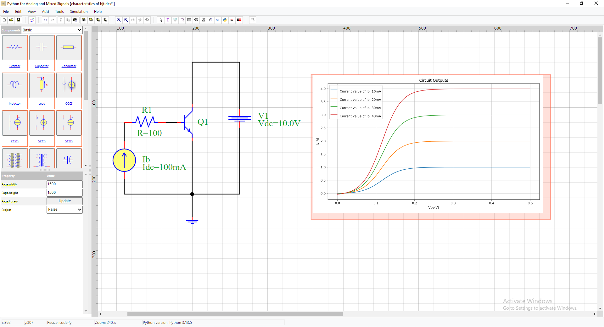

Simulation by analysis
=======================

The simulation of circuits in PyAMS-CAD is based by Graphical user interface in six steps:

:red:`Step a. Add Symbol in schematic`

.. figure:: ../images/pyams_02.png

* 1. Select Library
* 2. Click the symbol in the components list;
* 3. Click the position in the schematic;
* 4. Rotation

:red:`Step b. Linking elements by wire`

* 1. Click on the wire icon;
* 2. Connect the pins;
* 3. Modified name or color of wire;

.. figure:: ../images/pyams_04.png

.. note::

 You can finish drawing the wires by “end Menu".

:red:`Step c. Modifying parameters of elements`

* 1. Click on parameter
* 2. Change value or name

.. figure:: ../images/pyams_07.png

*  You can add new parameter or reference or label.

.. figure:: ../images/pyams_05.png

*  You can change global parameters from dialog.

.. figure:: ../images/pyams_08.png

.. note::
  These parameters in the dialog are automatically exported 
  from the Python model in the initial function.

.. figure:: ../images/pyams_09.png

.. note::
   You can modified model described by python language.

:red:`Step d. Adding a analysis in the circuit with adjusting type of analysis and add outputs`

* 1. Click on the analysis icon
* 2. Select Analysis
* 3. Select the type
* 4. Add outputs

:red:`Step e. run circuit`

.. figure:: ../images/pyams_11.png

* 1. Click on the analysis command icon.
* 2. Click Execute in the dialog box.
* 3. Exit.

:red:`Step f. results`

* The result present in plot.

.. figure:: ../images/pyams_13.png

* By show plot you can get values (X,Y).

Operating-Points
================

The OP analysis by PyAMS is find operating points in the circuit 
for time=0.
The simulation of circuits in OP is based by tree steps:
* 1. Add Probe
* 2. Get Name 
* 3. Run OP analysis

:red:`1. Add Probe`

.. figure:: ../images/pyams_14.png

:red:`2. Get Name`

.. figure:: ../images/pyams_15.png

:red:`3. Run OP analysis`

Simulation using PyCode
=======================

The **PyCode** feature allows circuit analysis and processing using Python, 
with the possibility of leveraging many user-installed packages such as 
``matplotlib``, ``numpy``, ``pandas``, and more.

.. note::

   You can add any Python version to PyAMS by selecting *Python* in the dialog 
   and using the *Python Path* option to specify the interpreter you want to use.

Steps for circuit study using PyCode
------------------------------------

1. Add a **PyCode** block to the schematic.
2. Click **Show** — a dialog will appear with two pages:
   
   - The first page displays the circuit code, which cannot be modified directly from the schematic.
   - The second page extends the first one, where you can apply circuit analysis 
     using built-in Python packages, along with ``pyams-lib``.

3. Execute the analysis and obtain the results.
4. Display the results in the graphical interface.

:red:`1. Add a PyCode block to the schematic`

:red:`2. Click Show`

* 1. The first page displays the circuit code, which cannot be modified directly from the schematic.

* 2. The second page extends the first one, where you can apply circuit analysis 

:red:`3. Execute the analysis and obtain the results`

  Click to save 

:red:`4. Display the results in the graphical interface`

